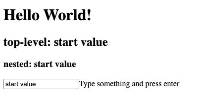

# Go-app-bugs

Tiny demonstration of a nesten component update problem


## Usage

```shell
GOARCH=wasm GOOS=js go build -o web/app.wasm
go run main.go
```

Open http://localhost:8000

## Issue

The nested component is not rendered with the updated value.

The initial value is propagated correctly



But after updating it, the nested component is still using the old value


## Notes

Interstingly the `app.TestMatch` doesn't fail and instead update the inner value correctly.
